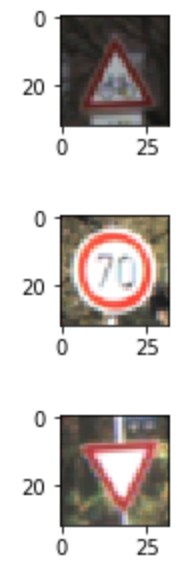
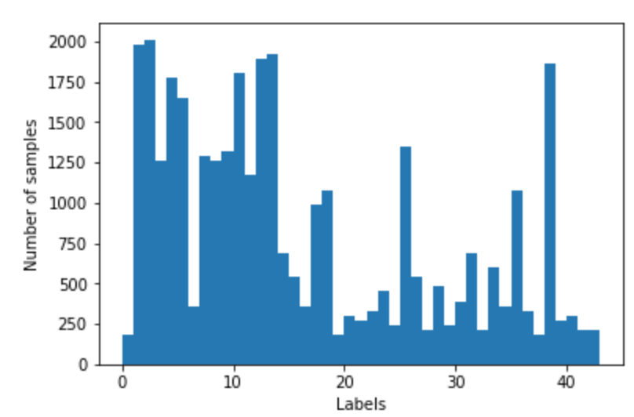
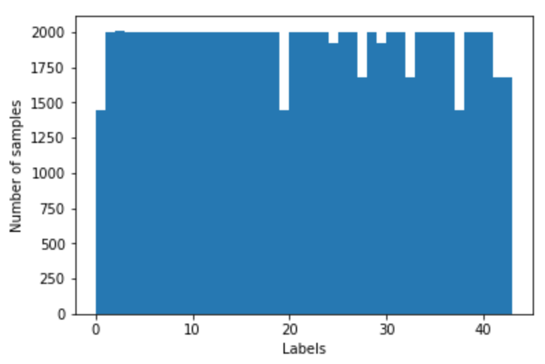
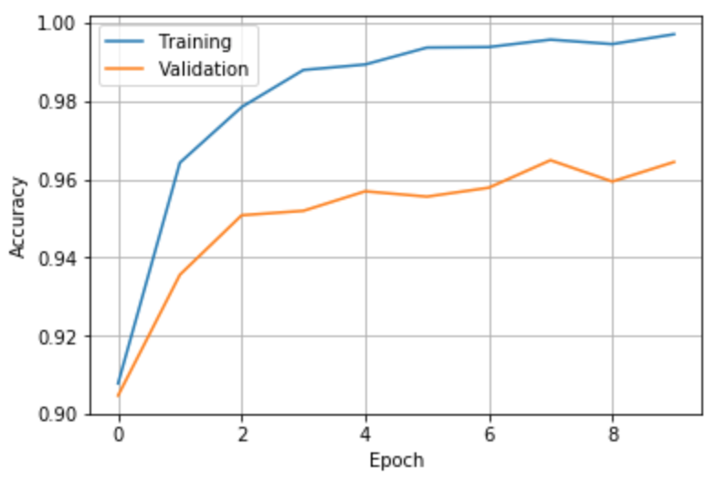

# **Traffic Sign Recognition** 

---

**Build a Traffic Sign Recognition Project**

The goals / steps of this project are the following:
* Load the data set (see below for links to the project data set)
* Explore, summarize and visualize the data set
* Design, train and test a model architecture
* Use the model to make predictions on new images
* Analyze the softmax probabilities of the new images
* Summarize the results with a written report

[//]: # (Image References)

[image1]: ./examples/visualization.jpg "Visualization"
[image2]: ./examples/grayscale.jpg "Grayscaling"
[image3]: ./examples/random_noise.jpg "Random Noise"
[image4]: ./examples/placeholder.png "Traffic Sign 1"
[image5]: ./examples/placeholder.png "Traffic Sign 2"
[image6]: ./examples/placeholder.png "Traffic Sign 3"
[image7]: ./examples/placeholder.png "Traffic Sign 4"
[image8]: ./examples/placeholder.png "Traffic Sign 5"

## Rubric Points
### Here I will consider the [rubric points](https://review.udacity.com/#!/rubrics/481/view) individually and describe how I addressed each point in my implementation.  

---
### Files Submitted

#### 1. Provide a Writeup / README that includes all the rubric points and how you addressed each one. You can submit your writeup as markdown or pdf. You can use this template as a guide for writing the report. The submission includes the project code.

The writeup file is the one you are reading.
The Jupyter project notebook is [here](https://github.com/stesalati/CarND-Traffic-Sign-Classifier-Project/blob/master/Traffic_Sign_Classifier.ipynb).
A HTML export of the notebook is [here](https://github.com/stesalati/CarND-Traffic-Sign-Classifier-Project/blob/master/Traffic_Sign_Classifier.html).

### Data Set Summary & Exploration

#### 1. Provide a basic summary of the data set. In the code, the analysis should be done using python, numpy and/or pandas methods rather than hardcoding results manually.

I used numpy to calculate summary statistics of the traffic signs data set:
* The size of training set is 34799 (then augmented to 82890)
* The size of the validation set is 4410
* The size of test set is 12630
* The shape of a traffic sign image is (32, 32, 3)
* The number of unique classes/labels in the data set is 43

#### 2. Include an exploratory visualization of the dataset.
Here are three examples taken from the dataset:

### Design and Test a Model Architecture

#### 1. Describe how you preprocessed the image data. What techniques were chosen and why did you choose these techniques? Consider including images showing the output of each preprocessing technique. Pre-processing refers to techniques such as converting to grayscale, normalization, etc. (OPTIONAL: As described in the "Stand Out Suggestions" part of the rubric, if you generated additional data for training, describe why you decided to generate additional data, how you generated the data, and provide example images of the additional data. Then describe the characteristics of the augmented training set like number of images in the set, number of images for each class, etc.)

The first step was augmenting the X_train dataset so to even out differences in the number of samples between different labels and to have a larger dataset.

Here are two bar charts showing how the data available in the dataset are distributed among the labels, the first is the original dataset while second is the augmented dataset.

To augment the dataset, the following approach (applied to every label with less than a specific number of samples, in this case 2000) was followed:
* Each image in the original dataset was rotated of -15 and +15°
* Each image in the original dataset was translated of 4 pixels in four directions
* The brightness of each image in the original dataset was increased of 50
* The so-created images were put together in a pool and shuffled
* A portion of that pool (the amount necessary to reach 2000, when possible) was appended to the original dataset

The second and last step consisted in normalising the dataset, scaling all images in the range [-1, +1], with two effects:
* Improve the contrast by "stretching" the image over the whole available range
* Uniform the magnitude of the coefficients

#### 2. Describe what your final model architecture looks like including model type, layers, layer sizes, connectivity, etc.) Consider including a diagram and/or table describing the final model.

My final model consisted of the following layers:

| Layer         		    |     Description	        					            | 
|:---------------------:|:---------------------------------------------:|
| Input         		    | 32x32x3 RGB image   							            |
| Convolution 5x5     	| 1x1 stride, valid padding, outputs 28x28x12 	|
| RELU					        |												                        |
| Dropout               | unused										                    |
| Max pooling	      	  | 2x2 stride,  outputs 14x14x12 				        |		 
| Convolution 5x5	      | 1x1 stride, valid padding, outputs 10x10x32	  |
| RELU					        |											            	            |
| Dropout               | unused										                    |
| Max pooling	      	  | 2x2 stride,  outputs 5x5x32 					        |
| Flatten				        | outputs 800									                  |
| Fully connected		    | inputs 800, outputs 240 						          |
| RELU					        |												                        |
| Dropout               | keep prob 0.5									                |
| Fully connected		    | inputs 240, outputs 168 						          |
| RELU					        |												                        |
| Dropout               | unused										                    |
| Fully connected		    | inputs 168, outputs 43 						            |
| Softmax				        | 	        									                  |

#### 3. Describe how you trained your model. The discussion can include the type of optimizer, the batch size, number of epochs and any hyperparameters such as learning rate.

* Optimiser: tf.train.AdamOptimizer was used, as suggested in the lesson about LeNet. The initial learning rate was 0.001.
* Batch size: 128 (I also tried 64 and 256 but didn't notice any significant improvement so I kept 128).
* Number of epochs: with a good initialisation of weights, 10 appeared to be enough. A higher number would have resulted in oscillations on the accuracy plot and most likely overfitting.
* Weights: were initialised with mu=0 and sigma=1/sqrt(n_outputs) as suggested in [literature](http://neuralnetworksanddeeplearning.com/chap3.html). Changing this from the original sigma=1/sqrt(0.1) led to a considerable improvement in learning as the accuracy curve reached high values (0.85-0.90) already in the first iterations.
Biases: were initialised to 0.

#### 4. Describe the approach taken for finding a solution and getting the validation set accuracy to be at least 0.93. Include in the discussion the results on the training, validation and test sets and where in the code these were calculated. Your approach may have been an iterative process, in which case, outline the steps you took to get to the final solution and why you chose those steps. Perhaps your solution involved an already well known implementation or architecture. In this case, discuss why you think the architecture is suitable for the current problem.

My final model results were:
* training set accuracy of 0.997
* validation set accuracy of 0.964
* test set accuracy of 0.952

The following plot shows the accuracy of the model on the training and validation sets over the epochs"

To build the model, an iterative approach was chosen:
* What was the first architecture that was tried and why was it chosen?
  LeNet, chosen as a starting point as it was the one covered in the course so far and light enough for my laptop.
* What were some problems with the initial architecture?
  Even generating more training data and trying different combinations of parameters, I was not able to improve the accuracy on the validation set above 0.90.
* How was the architecture adjusted and why was it adjusted? 
  The architecture was initially modified adding dropout layers after each convolutional and fully connected layers. A number of combinations of 0.5 and 1.0 keep probabilities where then tried. In the end, the solution described above was chosen.
  The biggest step was observed after doubling the depth of the convolutional layers and the size of the fully connected layers.
* Which parameters were tuned? How were they adjusted and why?
  I tried with different sizes for both the convolutional and fully connected layers. When I achieved a good result (an accuracy on the validation set of around 0.96).
* What are some of the important design choices and why were they chosen?
  I considered a few dropout layers (and in the end choose to have 1) to avoid overfitting and to build a "stronger" model.
  I tried converting the images in the YUV color space (of which one channel is black and white) but I couldn't see any major improvement.

###Test a Model on New Images

####1. Choose five German traffic signs found on the web and provide them in the report. For each image, discuss what quality or qualities might be difficult to classify.

I took 8 pictures of German traffic signs (I'm in Germany). All pictures were taken from random angles (from the car or walking) and with rainy weather.

Sample distribution before data augmentation
[mysign0]: ./traffic-signs-data/mydata/0.png "Sign 0"
[mysign1]: ./traffic-signs-data/mydata/1.png "Sign 1"
[mysign2]: ./traffic-signs-data/mydata/2.png "Sign 2"
[mysign3]: ./traffic-signs-data/mydata/3.png "Sign 3"
[mysign4]: ./traffic-signs-data/mydata/4.png "Sign 4"
[mysign5]: ./traffic-signs-data/mydata/5.png "Sign 5"
[mysign6]: ./traffic-signs-data/mydata/6.png "Sign 6"
[mysign7]: ./traffic-signs-data/mydata/7.png "Sign 7"

####2. Discuss the model's predictions on these new traffic signs and compare the results to predicting on the test set. At a minimum, discuss what the predictions were, the accuracy on these new predictions, and compare the accuracy to the accuracy on the test set (OPTIONAL: Discuss the results in more detail as described in the "Stand Out Suggestions" part of the rubric).

Here are the results of the prediction:

| Image			      								| Prediction	        						| 
|:-------------------------------------------------:|:---------------------------------------------:| 
| 10 - No passing for vehicles over 3.5 metric tons	| No passing for vehicles over 3.5 metric tons	| 
| 14 - Stop U-turn     								| Stop U-turn     								|
| 35 - Ahead only									| Ahead only									|
| 34 - Turn left ahead								| Turn left ahead								|
| 17 - No entry 									| No entry 										|
| 13 - Yield										| Yield											|
| 33 - Turn right ahead								| Turn right ahead								|
| 25 - Road work									| Road work										|

The model was able to correctly guess 8 of the 8 traffic signs, which gives an accuracy of 100%.
This compares favorably to the accuracy on the test set of 0.952

####3. Describe how certain the model is when predicting on each of the five new images by looking at the softmax probabilities for each prediction. Provide the top 5 softmax probabilities for each image along with the sign type of each probability. (OPTIONAL: as described in the "Stand Out Suggestions" part of the rubric, visualizations can also be provided such as bar charts)

The code for making predictions on my final model is located in the 16th cell of the Ipython notebook.

For the first image, the model is relatively sure that this is a stop sign (probability of 0.6), and the image does contain a stop sign. The top five soft max probabilities were

| Probability         	|     Prediction	        					| 
|:---------------------:|:---------------------------------------------:| 
| .60         			| Stop sign   									| 
| .20     				| U-turn 										|
| .05					| Yield											|
| .04	      			| Bumpy Road					 				|
| .01				    | Slippery Road      							|

The model prediction is very accurate for each image, with softmax probabilities for the "winning" choice above 0.999.
A bar chart example is shown below, but, being the probability so high, it doesn't represent much.

### (Optional) Visualizing the Neural Network (See Step 4 of the Ipython notebook for more details)
####1. Discuss the visual output of your trained network's feature maps. What characteristics did the neural network use to make classifications?

